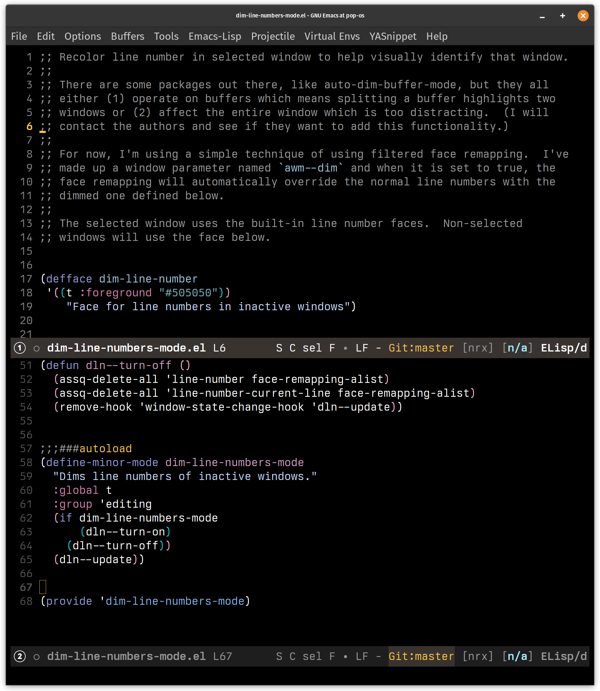

This is a simple mode to use different faces (fonts / colors) in active windows and inactive
windows.  The purpose is to emphasize the current window without affecting the readability of
the main portion of the page.

I've tried using different mode line colors, but since they are below the window, they aren't
as apparent as line numbers.

Since this technique can be used for any face, this mode may be discontinued if another
package can be configured to do this or it may be expanded to support other faces.  In the
meantime, it works by using the default line-number face for the active window and the
dim-line-number face (provided here) for inactive ones.

This is not on MELPA yet, so copy the dim-line-number-mode.el file locally and put it in your
lisp path.  I use ~/.emacs.d/lisp and configure use-package to load from there using :load-path

    (use-package dim-line-numbers-mode
      :load-path "lisp"
      :config
      (dim-line-numbers-mode 1))

Be sure to configure the dim-line-number face to match your theme.  I use Modus Vivendi with
already dim gray numbers, but with a bright orange/yellow cursor and active line number.  I use
the default dim-line-number of a very dark gray.  The dark gray numbers make it obvious the
window is inactive and the removal of the yellow active line number helps draw the eye to the
active window.

As an example, in this screenshot, the top window is active and the cursor is on line 6.  The
bottom window is inactive.

